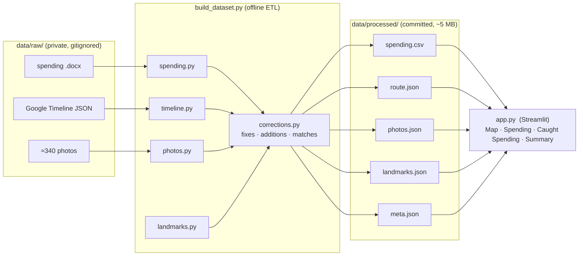

# Architecture

## The core idea: two separate phases

The project is split into an offline **build** phase and a lightweight **app**
phase. Understanding that split explains everything else.

1. **Build (offline, run once on my machine).** All the heavy, messy work —
   parsing, cleaning, geotagging, thumbnailing — happens here and writes small,
   clean output files.
2. **App (deployed).** Streamlit just reads those clean files and draws them.
   No raw data, no parsing, and no API calls at runtime.

**Why it's built this way:** the raw sources are ~660 MB of personal photos and
location history that must never be published. The deployed app only ever sees
the derived files (300 px thumbnails + parsed tables), so the project is both
**deployable** and **privacy-preserving**.

---

## Phase 1 — the pipeline (ETL)

`build_dataset.py` orchestrates the modules in `pipeline/`:

| Module | Job |
|---|---|
| `config.py` | Shared settings — paths, exchange rates, category rules, country bounding boxes. |
| `spending.py` | Parse the free-text `.docx` log → clean rows (date, country, category, currency, amount, USD). The hard part: four currencies, missing markers, typos, multi-line entries. |
| `timeline.py` | Parse the Google Timeline JSON → an ordered list of GPS points (the movement route). |
| `photos.py` | Read each photo's **EXIF** GPS + timestamp, tag it to a country by bounding box, and build a 300 px thumbnail. GPS-less photos are skipped. |
| `landmarks.py` | Keep only curated landmarks the trip data actually passes near (validated by **haversine** distance) and count nearby photos. |
| `vision.py` | *Optional* automated photo→purchase matcher via the Claude vision API (the free hand-curated matches are used instead). |

Output → `data/processed/` (committed):

| File | Contents |
|---|---|
| `spending.csv` | The cleaned, categorized, USD-converted spending table. |
| `route.json` | Per-country movement routes + visit points. |
| `photos.json` | Geotagged photos: location, date, thumbnail, and any purchase match. |
| `landmarks.json` | Validated landmarks with nearby-photo counts. |
| `meta.json` | Summary counts and totals. |

---

## The human-in-the-loop layer

`corrections.py` is where real-world knowledge **overrides** the raw data —
transparently and reproducibly, instead of editing the original files:

- **spending corrections** — e.g. the ฿3,900 → ฿1,300 wallet typo
- **supplemental entries** — flights and the Airbnb that weren't in the log
- **photo corrections** — fixing a photo's stale GPS (pineapple cakes: Bangkok → Taipei)
- **manual matches** — photo ↔ purchase links, editable in `data/matches.csv`

This mirrors how an analyst handles a system-of-record they don't own: the raw
source stays immutable, and every adjustment is documented and auditable. The
curation tooling (`make_reference.py`, `apply_matches.py`) is described in
[`MATCHING.md`](MATCHING.md).

---

## Phase 2 — the app (`app.py`)

A single Streamlit file. On load it:

1. Reads the committed `data/processed/` files (cached for speed).
2. Computes aggregates and the "key findings" with **pandas**.
3. Renders four tabs:
   - **Map** — Folium map: photo pins, landmarks, the Thailand route, a heatmap.
   - **Spending** — an annotated day-by-day journey timeline + Plotly charts + findings.
   - **Caught Spending** — the price-tagged photo→purchase gallery. Thumbnails
     are inline base64; clicking one opens a pure-CSS lightbox that lazy-loads a
     larger image from `static/` (Streamlit static serving), so the tab stays
     light until a photo is actually enlarged.
   - **Summary** — metric cards + the full sortable table.
4. All styling is one block of injected CSS (the minimal dark theme).

The app does no scraping, parsing, or API work — it only presents. That's what
makes it deploy cleanly and load fast.

---

## The mental model

> **Raw private data → (build once) → small clean data → (committed) → the app just draws it.**
> Corrections and matches sit on top as a documented layer, so nothing is ever silently changed.

The story end-to-end: **collect → clean → model → correct → visualize**, with a
privacy-preserving build/serve split.
